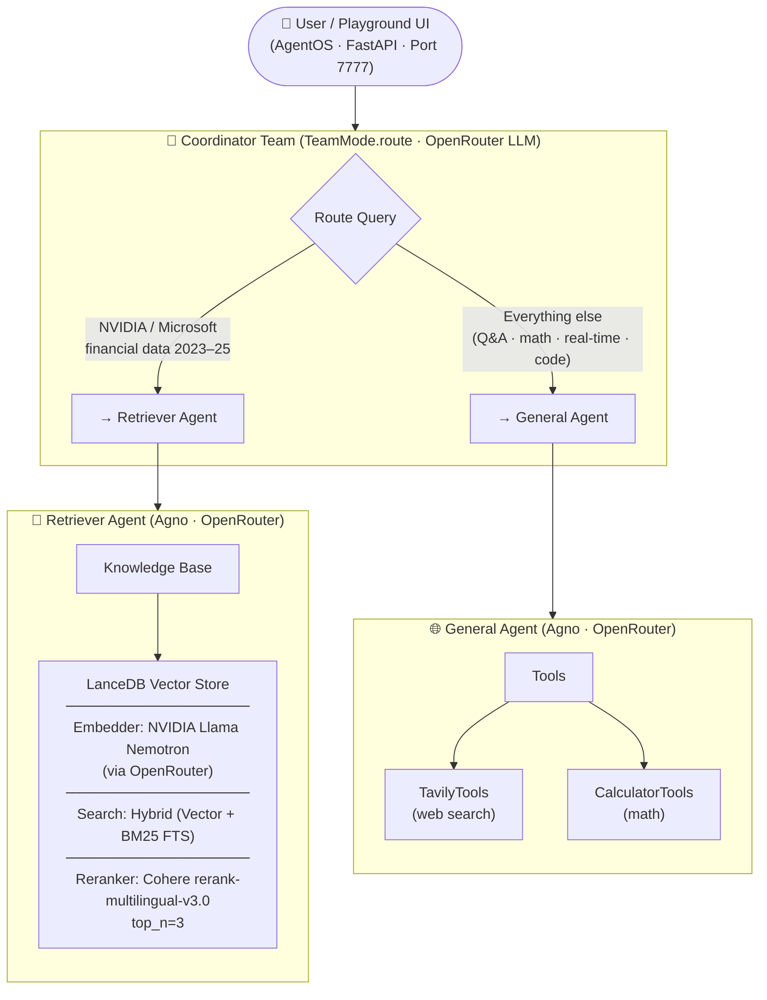
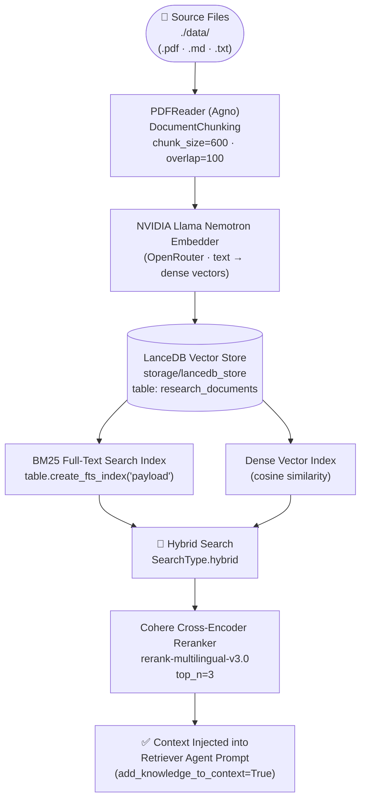

# 🧠 Research Multi-Agent System

A production-ready multi-agent AI system built on the **Agno Agent OS** framework. It routes user queries to either a RAG-powered document retriever or a general-purpose reasoning agent, backed by a hybrid LanceDB vector store, Cohere reranking, and optional Tavily web search.

---

## 📐 Architecture



### Data Ingestion Pipeline



---

## 📁 Project Structure

```
Multi-Agent-AI-System/
├── Agents/
│   ├── agents.py               # Retriever Agent & General Agent definitions
│   └── orchestrator.py         # Coordinator Team (router)
├── agent-ui/                   # AgentOS frontend UI assets
├── data/
│   ├── Microsoft_10k.pdf       # Microsoft 10-K filing (source document)
│   └── nvidia_10k.pdf          # NVIDIA 10-K filing (source document)
├── evaluations/
│   ├── evaluate_rag.py         # RAG retrieval quality evaluation scripts
│   └── evaluate_routing.py     # Coordinator routing accuracy evaluation
├── RAG/
│   ├── ingest.py               # PDF ingestion, chunking, FTS index builder
│   └── knowledge.py            # LanceDB Knowledge base config
├── storage/
│   └── lancedb_store/          # Persisted vector DB (auto-created on ingest)
│       ├── __manifest          # LanceDB internal manifest
│       └── research_documents.lance
├── tracing/
│   └── logger.py               # Centralized logging utility
├── .env                        # API keys (not committed)
├── .gitignore
├── config.py                   # All model, embedder, reranker, key config
├── debug_db.py                 # LanceDB inspection / debugging utility
├── debug_schema.py             # Schema validation / debugging utility
├── main.py                     # CLI entrypoint for running agents directly
├── playground.py               # AgentOS FastAPI entrypoint (port 7777)
├── README.md
└── requirements.txt
```

---

## ⚙️ Setup & Installation

### 1. Clone and create a virtual environment

```bash
git clone <your-repo-url>
cd <repo-name>
python -m venv venv
source venv/bin/activate      # Windows: venv\Scripts\activate
```

### 2. Install dependencies

```bash
pip install -r requirements.txt
```

### 3. Configure environment variables

Create a `.env` file in the project root:

```env
OPENROUTER_API_KEY=your_openrouter_key
TAVILY_KEY=your_tavily_key
COHERE_API_KEY=your_cohere_key
```

| Variable | Purpose |
|---|---|
| `OPENROUTER_API_KEY` | Powers the LLM (GPT-OSS 120B via OpenRouter) and the NVIDIA embedder |
| `TAVILY_KEY` | Web search for the General Agent |
| `COHERE_API_KEY` | Cross-encoder reranking in the Retriever Agent |

### 4. Add documents

Place your `.pdf`, `.md`, or `.txt` files inside the `data/` directory.

### 5. Ingest documents into LanceDB

```bash
python -m RAG.ingest
```

This will:
- Chunk all documents (chunk size: 600 tokens, overlap: 100)
- Embed them using NVIDIA Llama Nemotron via OpenRouter
- Store dense vectors in LanceDB
- Build a BM25 full-text search index on the `payload` column

> Pass `recreate=True` (already set in `__main__`) to wipe and rebuild the index from scratch — use this when you update source documents to avoid duplicate vectors.

### 6. Launch the playground

```bash
python playground.py
```

The AgentOS FastAPI server starts at `http://localhost:7777`. Open the AgentOS UI in your browser to interact with the system.

---

## 🔍 How Routing Works

The **Coordinator Team** inspects each user query using `TeamMode.route` and dispatches it to exactly one agent:

| Query type | Routed to |
|---|---|
| NVIDIA / Microsoft financial metrics, risk factors, disclosures (2023–25) | `Retriever Agent` |
| Real-time stock prices | `General Agent` (Tavily web search) |
| Math / calculations | `General Agent` (Calculator tool) |
| General knowledge, coding, conversation | `General Agent` |

---

## 🤖 Agents

### Retriever Agent

- Uses `add_knowledge_to_context=True` — retrieved chunks are injected directly into the model prompt rather than relying on an autonomous search tool call. This guarantees the context is always present.
- `search_knowledge=False` disables the agent's autonomous tool-call search, keeping retrieval fully controlled by the knowledge base pipeline.
- Responds with a structured answer and an **Evidence & Sources** section citing document name, page number, and a summarized snippet per chunk used.

### General Agent

- Has access to **TavilyTools** (`search_depth="basic"`) for live web queries.
- Has access to **CalculatorTools** for arithmetic and math expressions.
- Falls back to the LLM's own knowledge for factual/conversational queries.

---

## 🏗️ Design Decisions

### 1. Hybrid Search (Vector + BM25) over pure vector search

Pure semantic search can miss exact-match queries (e.g., a specific revenue figure, a ticker symbol, a year). BM25 keyword matching covers these cases reliably. Combining both via `SearchType.hybrid` in LanceDB gives the best of both retrieval paradigms without running two separate databases.

### 2. Cohere cross-encoder reranking (`top_n=3`)

Initial hybrid retrieval can return semantically similar but contextually weak chunks. A cross-encoder reranker scores each chunk against the full query jointly (rather than independently), producing a significantly more relevant final context window. Limiting to `top_n=3` keeps token consumption low while maximizing precision.

### 3. `add_knowledge_to_context=True` + `search_knowledge=False`

This combination makes the Retriever Agent's behavior deterministic. Instead of the agent autonomously deciding when and whether to search, the knowledge base context is always pre-injected into the prompt. This removes a failure mode where the agent skips retrieval and answers from parametric memory.

### 4. OpenRouter as a unified inference gateway

All LLM and embedding calls route through OpenRouter. This decouples the system from any single provider — the model string in `config.py` (`LLM_MODEL`) is the only thing that needs to change to swap models. The NVIDIA Llama Nemotron embedding model is also served through OpenRouter, eliminating a separate API key.

### 5. Coordinator as a `Team` with `TeamMode.route`

Agno's `TeamMode.route` is a single-dispatch pattern — the coordinator evaluates the query once and forwards it to exactly one member. This is simpler and cheaper than `TeamMode.collaborate` (where multiple agents respond and results are merged) and appropriate here since the two agents have mutually exclusive domains.

### 6. Centralized config in `config.py`

All models, keys, and external service clients are instantiated once in `config.py` and imported wherever needed. This prevents multiple client initializations and makes model/provider swaps a single-line change.

### 7. `recreate` flag in ingestion

The `recreate=True` flag in `initialize_knowledge_base` performs a hard wipe of `storage/lancedb_store` before re-ingesting. This is intentional: LanceDB does not deduplicate on re-insert, so running ingestion twice without wiping produces duplicate vectors and degrades retrieval quality. The flag makes the safe path explicit.

---

## ⚖️ Tradeoffs

| Decision | Benefit | Cost |
|---|---|---|
| Hybrid BM25 + vector search | Handles both semantic and keyword queries | Requires building and maintaining a separate FTS index on `payload`; index must be rebuilt on schema changes |
| Cohere reranker (`top_n=3`) | High-precision final context | Extra API call per retrieval; adds latency; Cohere is a third external dependency |
| `add_knowledge_to_context` (no autonomous search) | Deterministic, always-on retrieval | Cannot dynamically decide to skip retrieval for off-topic queries — coordinator routing must be accurate |
| OpenRouter for both LLM and embeddings | Single API key, easy model swaps | Rate limits and availability are subject to OpenRouter's infrastructure; model IDs can change |
| `TeamMode.route` (single dispatch) | Simple, cheap, predictable | If the coordinator misroutes a query, there is no fallback or retry — the wrong agent handles it entirely |
| `chunk_size=600, overlap=100` | Good context density; overlap prevents boundary truncation | Larger chunks → more tokens per retrieval call → higher cost; overlap creates minor redundancy |
| Hard `recreate` wipe on re-ingest | No duplicate vectors | Entire index is rebuilt from scratch every time documents change — no incremental update |

---

## 📋 Environment Dependencies Summary

| Service | Used for | Key |
|---|---|---|
| OpenRouter | LLM inference (GPT-OSS 120B) + NVIDIA embedder | `OPENROUTER_API_KEY` |
| Cohere | Cross-encoder reranking | `COHERE_API_KEY` |
| Tavily | Live web search (General Agent) | `TAVILY_KEY` |
| LanceDB | Local vector + FTS storage | — (local file) |
| Agno Agent OS | Agent/Team orchestration + FastAPI runtime | — (pip package) |

---

## 📝 Logging

All system events are logged via the centralized `sys_logger` (defined in `tracing/logger.py`). Logs are printed to stdout with timestamps, level, and logger name. To add logging elsewhere, import and reuse `setup_logger`:

```python
from tracing.logger import setup_logger
logger = setup_logger("MyModule")
logger.info("Something happened")
```
