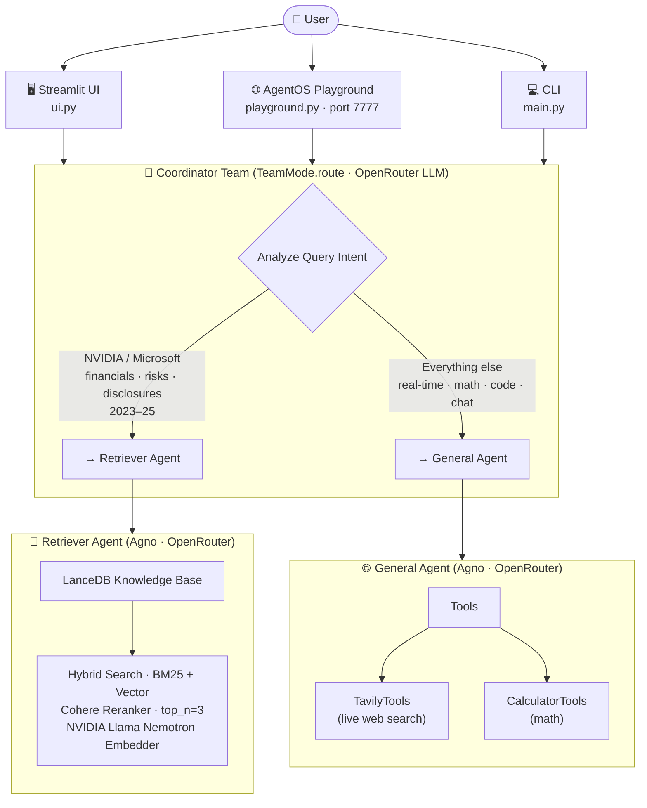
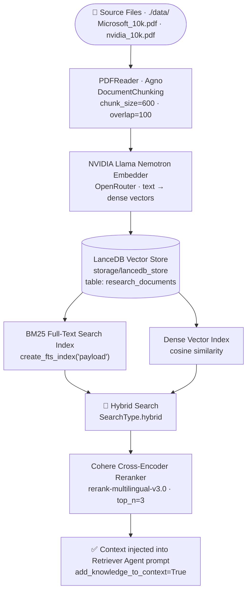

# 🧠 Research Multi-Agent System

A production-ready multi-agent AI system built on the **Agno Agent OS** framework. It intelligently routes user queries to either a RAG-powered document retriever (grounded in NVIDIA and Microsoft 10-K filings) or a general-purpose reasoning agent equipped with live web search and a calculator. The system is accessible via three interfaces: an AgentOS playground UI, a Streamlit chat UI, and a terminal CLI.

---

## 📐 System Architecture



### Data Ingestion Pipeline



---

## 📁 Project Structure

```
Multi-Agent-AI-System/
├── Agents/
│   ├── agents.py               # Retriever Agent & General Agent definitions
│   └── orchestrator.py         # Coordinator Team (router)
├── agent-ui/                   # AgentOS built-in frontend UI assets
├── data/
│   ├── Microsoft_10k.pdf       # Microsoft FY2025 10-K filing (source document)
│   └── nvidia_10k.pdf          # NVIDIA FY2025 10-K filing (source document)
├── evaluations/
│   ├── evaluate.py      # End-to-end eval: routing + relevancy + hallucination
├── RAG/
│   ├── ingest.py               # PDF ingestion, chunking, FTS index builder
│   └── knowledge.py            # LanceDB knowledge base config
├── storage/
│   └── lancedb_store/          # Persisted vector DB (auto-created on ingest)
│       ├── __manifest          # LanceDB internal manifest
│       └── research_documents.lance
├── tracing/
│   └── logger.py               # Centralized logging utility
├── .env                        # API keys (not committed)
├── .gitignore
├── config.py                   # All models, embedder, reranker, key config
├── debug_db.py                 # LanceDB inspection / debugging utility
├── debug_schema.py             # Schema validation / debugging utility
├── main.py                     # Terminal CLI entrypoint
├── playground.py               # AgentOS FastAPI entrypoint (port 7777)
├── ui.py                       # Streamlit chat UI
├── README.md
└── requirements.txt
```

---

## ⚙️ Setup & Installation

### 1. Clone and create a virtual environment

```bash
git clone <your-repo-url>
cd Multi-Agent-AI-System
python -m venv venv
source venv/bin/activate        # Windows: venv\Scripts\activate
```

### 2. Install dependencies

```bash
pip install -r requirements.txt
```

### 3. Configure environment variables

Create a `.env` file in the project root:

```env
OPENROUTER_API_KEY=your_openrouter_key
TAVILY_KEY=your_tavily_key
COHERE_API_KEY=your_cohere_key
```

| Variable | Purpose |
|---|---|
| `OPENROUTER_API_KEY` | LLM inference (GPT-OSS 120B) + qwen3 embedder |
| `TAVILY_KEY` | Live web search for the General Agent |
| `COHERE_API_KEY` | Cross-encoder reranking in the Retriever Agent |

> `config.py` validates all three keys at startup and raises a `RuntimeError` immediately if any are missing — so the system fails fast with a clear message rather than crashing mid-request.

### 4. Ingest documents into LanceDB

Place any `.pdf`, `.md`, or `.txt` files in the `data/` directory, then run:

```bash
python -m RAG.ingest
```

This will:
- Chunk all documents (chunk size: 600 tokens, overlap: 100)
- Embed chunks using qwen/qwen3-embedding-8b via OpenRouter
- Store dense vectors in LanceDB under `storage/lancedb_store`
- Build a BM25 full-text search index on the `payload` column for hybrid retrieval

> The `recreate=True` flag (set by default in `__main__`) wipes and rebuilds the index from scratch on each run. This is intentional — LanceDB does not deduplicate on re-insert, so rebuilding prevents duplicate vectors from degrading retrieval quality.

---

## 🚀 Running the System

There are three ways to interact with the system. All three share the same Coordinator, agents, and knowledge base.

### Option A — Streamlit Chat UI (recommended)

```bash
streamlit run ui.py
```

Opens a chat interface in your browser. Type your query, and the system streams the routed agent's response back in real time.

### Option B — AgentOS Playground UI

```bash
python playground.py
```

Starts a FastAPI server at `http://localhost:7777`. The AgentOS built-in UI provides a full multi-agent workspace with conversation history and agent visibility.

### Option C — Terminal CLI

```bash
python main.py
```

Runs an interactive REPL in the terminal. Type `exit` or `quit` to stop.

```
============================================================
🤖 Multi-Agent Research Assistant Initialized
   (Type 'exit' to quit)
============================================================

User: What was NVIDIA's revenue in FY2025?
```

---

## 🔍 How Routing Works

The **Coordinator Team** uses `TeamMode.route` to dispatch each query to exactly one agent. The routing decision is made by the LLM based on the instructions and few-shot examples provided in `orchestrator.py`.

| Query type | Routed to | Tool used |
|---|---|---|
| NVIDIA / Microsoft financial metrics, risk factors, disclosures (2023–25) | `Retriever Agent` | LanceDB hybrid search + Cohere reranker |
| Real-time stock prices or current market data | `General Agent` | Tavily web search |
| Math / calculations | `General Agent` | CalculatorTools |
| General knowledge, coding, conversation | `General Agent` | LLM parametric memory |

**Routing boundary examples from `orchestrator.py`:**

| Query | Route | Reason |
|---|---|---|
| `"NVIDIA revenue in fiscal year 2024"` | RETRIEVER | Revenue is in the 10-K filing |
| `"Microsoft risk factors disclosed"` | RETRIEVER | Risk factors are in the 10-K filing |
| `"What is Microsoft's current stock price?"` | GENERAL | Requires real-time web search |
| `"Calculate compound interest"` | GENERAL | Requires calculator tool |

---

## 🤖 Agents

### Retriever Agent

Answers questions **strictly from the knowledge base** — NVIDIA and Microsoft 10-K filings ingested into LanceDB.

- `add_knowledge_to_context=True` injects retrieved chunks directly into the model prompt, guaranteeing context is always present.
- `search_knowledge=False` disables the agent's autonomous search tool call, keeping retrieval fully controlled and deterministic.
- Every response includes a structured **📚 Evidence & Sources** section citing document name, page number, and a summarized snippet per chunk used.
- Explicitly states when the context does not contain an answer, rather than hallucinating from parametric memory.

### General Agent

Handles everything outside the financial document domain.

- **TavilyTools** (`search_depth="basic"`) for live web queries — real-time prices, news, general knowledge.
- **CalculatorTools** for arithmetic, compound interest, percentage calculations, and similar math.
- Falls back to the LLM's own knowledge for factual or conversational queries that require no external data.

---

## 🏗️ Design Decisions

### 1. LanceDB over DuckDB for vector storage

The project brief mentioned DuckDB as a potential vector store. LanceDB was chosen deliberately for this use case for the following reasons:

**DuckDB** is an OLAP analytical query engine. While it supports vector similarity search via extensions, it is not purpose-built for it — its indexing, hybrid retrieval, and embedding pipeline integrations are significantly less mature. Embedding millions of vectors into DuckDB requires manual glue code, and BM25 FTS support is not native.

**LanceDB** is a purpose-built embedded vector database backed by the Lance columnar format. Specifically for this project:
- Native `SearchType.hybrid` combines dense vector search and BM25 FTS in a single call with no external infrastructure
- First-class Agno integration via `agno.vectordb.lancedb.LanceDb` — zero boilerplate for embedding, ingestion, and retrieval
- `create_fts_index("payload")` builds a production-grade BM25 index directly on the stored column
- Runs fully embedded (no server process) — same operational simplicity as DuckDB, but optimized for the vector retrieval workload this system actually performs

10-K filings are dense, highly specific financial documents with exact figures, regulatory terminology, and named entities. LanceDB's hybrid search — catching both semantic meaning and exact keyword matches — is better suited to this domain than DuckDB's vector extensions.

### 2. Hybrid Search (Vector + BM25) over pure vector search

10-K filings contain highly specific numerical data — exact revenue figures (`$130,497M`), precise fiscal year labels (`FY2025`), regulatory product names (`H100`, `A100`), and legal terminology. Pure semantic search compresses these into fuzzy embedding neighborhoods where exact values can be missed or confused across years. BM25 keyword matching acts as a safety net for these high-precision lookups. `SearchType.hybrid` in LanceDB merges both result sets, capturing queries that are purely semantic ("what are the risk factors") and queries that are purely exact-match ("what was the FY2025 Compute & Networking operating income").

### 3. Cohere cross-encoder reranking (`top_n=3`)

Initial hybrid retrieval returns the top-10 candidates ranked by a combination of BM25 and cosine scores. These are bi-encoder scores — each chunk is scored independently against the query embedding, which means subtle relevance distinctions are lost. A cross-encoder reranker (Cohere `rerank-multilingual-v3.0`) scores each candidate chunk by attending to the query and the chunk *jointly*, the same way a reader would evaluate relevance. This is substantially more accurate but more expensive, so it is applied only to the final shortlist. Limiting to `top_n=3` keeps the final context window tight, reducing hallucination risk and token cost while delivering the three most precisely relevant chunks.

### 4. `add_knowledge_to_context=True` + `search_knowledge=False`

These two flags together make the Retriever Agent's behavior deterministic. By default, Agno agents with a knowledge base autonomously decide whether to invoke a search tool — which introduces a failure mode where the agent, feeling confident in its parametric memory, skips retrieval entirely and answers from training data. For financial document QA, this is unacceptable: the ground truth must come from the filing. Setting `search_knowledge=False` removes the autonomous decision, and `add_knowledge_to_context=True` pre-injects the retrieved context into every prompt unconditionally.

### 5. OpenRouter as a unified inference gateway

All LLM calls (Coordinator, Retriever Agent, General Agent) and embedding calls (qwen/qwen3-embedding-8b) route through OpenRouter. This decouples the system from any single provider API. Swapping the underlying model requires changing one string (`LLM_MODEL` in `config.py`) rather than touching authentication, client initialization, or endpoint logic across multiple files. It also means the qwen3 embedding model is accessible without a separate qwen API key.

### 6. Coordinator as `TeamMode.route` (single dispatch)

`TeamMode.route` forwards each query to exactly one team member. The alternative, `TeamMode.collaborate`, would have all agents respond and merge results — appropriate for tasks where multiple perspectives add value, but wasteful and potentially contradictory here, since the RAG domain and the general domain are mutually exclusive. Single dispatch is cheaper (one LLM call for routing + one agent call), faster, and produces a cleaner response with a single authoritative source.

### 7. Fail-fast key validation in `config.py`

All three API keys are validated at import time using walrus-operator assignments. If any key is missing, a `RuntimeError` is raised immediately before any agent or model is initialized. This prevents a class of silent failures where the system appears to start correctly but crashes mid-conversation with an opaque authentication error.

### 8. `recreate` flag in ingestion

LanceDB does not deduplicate vectors on re-insert. Running `ingest.py` twice on the same documents without wiping would double the vector count, causing every query to receive duplicate chunks with artificially inflated scores. The `recreate=True` flag performs a hard `shutil.rmtree` on `storage/lancedb_store` before re-ingesting, guaranteeing a clean build. This is the safe default for a single-collection system where the full corpus fits comfortably in a re-ingest window.

---

## ⚖️ Tradeoffs

| Decision | Benefit | Cost |
|---|---|---|
| LanceDB over DuckDB | Purpose-built for hybrid vector + BM25 retrieval; native Agno integration | Less familiar to SQL-first analysts; not a general-purpose query engine |
| Hybrid BM25 + vector search | Handles both semantic and exact-keyword queries | FTS index must be rebuilt on schema changes; `payload` column name is tightly coupled to Agno's internals |
| Cohere reranker (`top_n=3`) | High-precision final context window; cross-encoder accuracy | Extra API call adds ~0.5–1s latency; Cohere is a third external dependency |
| `add_knowledge_to_context` (no autonomous search) | Deterministic, always-on retrieval | Cannot skip retrieval for clearly off-topic queries — coordinator routing accuracy is critical |
| OpenRouter unified gateway | Single API key; one-line model swaps | Rate limits and uptime depend on OpenRouter's infrastructure; model IDs can change |
| `TeamMode.route` (single dispatch) | Simple, cheap, fast, clean responses | No fallback if coordinator misroutes; wrong agent handles the query entirely |
| `chunk_size=600, overlap=100` | Good context density; overlap prevents answer truncation at chunk boundaries | Larger chunks = more tokens per retrieval = higher cost; overlap creates minor content redundancy |
| Hard `recreate` wipe on re-ingest | No duplicate vectors; guaranteed clean index | Full re-ingest on every document update; no incremental add |

---

## 🧪 Evaluation

The `evaluations/evaluate_system.py` script runs 10 test cases against the live system and scores it across three dimensions:

| Dimension | Points | Method |
|---|---|---|
| Routing accuracy | +4 | Detects which agent header appears in the response |
| Answer relevancy | +4 | Checks that ≥1 expected keyword (e.g. `"130,497"`, `"azure"`) is present |
| Hallucination guard | +2 | Checks that known-wrong figures (e.g. prior year revenue) are absent |

**Max score: 100 (10 cases × 10 pts)**

```bash
# Make sure the knowledge base is ingested first
python -m RAG.ingest

# Run the evaluation
python evaluations/evaluate_system.py
```

Sample output:

```
══════════════════════════════════════════════════════════════════════
  RESEARCH MULTI-AGENT SYSTEM — EVALUATION REPORT
══════════════════════════════════════════════════════════════════════

ID   Category           Routing    Relevancy    No Halluc    Score    Latency
──────────────────────────────────────────────────────────────────────
1    RAG – NVIDIA       ✅          ✅            ✅            10/10    4.2s
2    RAG – NVIDIA       ✅          ✅            ✅            10/10    5.1s
...
══════════════════════════════════════════════════════════════════════
  Overall Score      : 92 / 100  (92.0%)
  Routing Accuracy   : 10/10  (100%)
  Answer Relevancy   : 9/10   (90%)
  Hallucination-Free : 9/10   (90%)
  Avg Latency        : 4.8s
  Grade : A  — Production-ready
══════════════════════════════════════════════════════════════════════
```

### Test Case Coverage

| # | Category | Query focus | Ground truth |
|---|---|---|---|
| 1 | RAG – NVIDIA | Total FY2025 revenue | $130,497M (income statement) |
| 2 | RAG – NVIDIA | Gross margin FY25 vs FY24 | 75.0% vs 72.7% |
| 3 | RAG – NVIDIA | H100/A100 China export control risks | Risk factors section |
| 4 | RAG – NVIDIA | R&D spend FY2025 | $12,914M |
| 5 | RAG – NVIDIA | Two operating segments + revenues | Compute & Networking $116,193M; Graphics $14,304M |
| 6 | RAG – MSFT | Total revenue + operating income FY2025 | $281,724M / $128,528M |
| 7 | RAG – MSFT | Intelligent Cloud revenue + growth driver | $106,265M; Azure +34% |
| 8 | RAG – MSFT | Cybersecurity / AI risk disclosures | Item 1A risk factors |
| 9 | GENERAL | NVIDIA current stock price | Real-time → Tavily web search |
| 10 | GENERAL | Math: revenue growth % calculation | 114% growth → CalculatorTools |

---

## ⚠️ Known Limitations

- **No incremental ingestion.** Adding a new document requires a full re-ingest with `recreate=True`. A production system would maintain document-level hashes to ingest only changed files.
- **No routing fallback.** `TeamMode.route` is single-dispatch with no retry. If the coordinator misroutes a query (e.g. routes a real-time query to the Retriever), the wrong agent handles it with no correction mechanism.
- **`top_n=3` may be too aggressive for complex multi-part questions.** A question spanning multiple fiscal years or multiple topics may need more than 3 chunks to answer fully.
- **FTS index is tightly coupled to the `payload` column name.** Agno writes chunks to a column named `payload`; the FTS index must be built on exactly this column name. Any schema change in a future Agno version would require updating `ingest.py`.

---

## 📋 Environment Dependencies Summary

| Service | Used for | Key |
|---|---|---|
| OpenRouter | LLM inference (GPT-OSS 120B) + NVIDIA Llama Nemotron embedder | `OPENROUTER_API_KEY` |
| Cohere | Cross-encoder reranking (`rerank-multilingual-v3.0`) | `COHERE_API_KEY` |
| Tavily | Live web search (General Agent) | `TAVILY_KEY` |
| LanceDB | Embedded vector + BM25 FTS storage | — (local file, no server) |
| Agno Agent OS | Agent/Team orchestration + FastAPI + Streamlit runtime | — (pip package) |

---

## 📝 Logging

All system events are logged via the centralized `sys_logger` in `tracing/logger.py`. Logs are written to stdout with timestamps, log level, and module name. To use the logger in any new module:

```python
from tracing.logger import setup_logger
logger = setup_logger("MyModule")
logger.info("Something happened")
```
