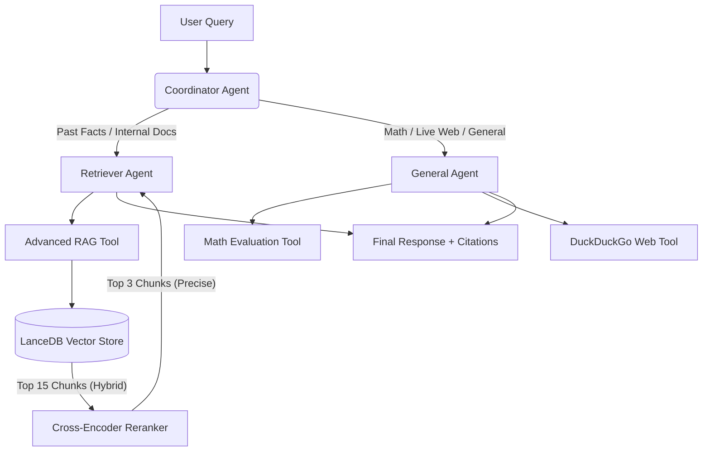

# 🤖 Multi-Agent Research Assistant

An enterprise-grade, Multi-Agent AI architecture designed to intelligently route user queries, perform mathematical calculations, execute real-time web searches, and query dense document repositories using a high-precision Two-Stage RAG pipeline.

---

## 🏗️ Architecture & Control Flow

The system employs a centralized Coordinator pattern to cleanly separate intent classification from task execution. This decoupling keeps context windows lightweight, eliminates tool execution conflicts, and optimizes downstream reasoning.



### Execution Lifecycles

1. **Ingestion Loop:** Local text and reference PDF manuals are ingested via standard PDF parsers, processed into semantic chunks, transformed into vector representations using localized embedding weights, and written to a performant local **LanceDB** database.
2. **Orchestration Loop:** User prompts target the **Coordinator** first. The Coordinator operates as a deterministic semantic router, evaluating the payload and emitting exactly one categorical route token: `GENERAL` or `RETRIEVER`.
3. **Execution Loop (Worker Tier):** The custom Streamlit application layer intercepts the routing token and hands execution off to the corresponding target agent workspace (`General_Agent` or `Retriever_Agent`).
4. **Two-Stage RAG Validation:** When routed to the `Retriever_Agent`, the system runs a fast, hybrid search across LanceDB (extracting 15 candidate chunks), which are mathematically scored and filtered down locally via an `ms-marco` Cross-Encoder to the absolute top 3 most precise fragments before hitting the LLM context window.

---

## 🧠 Design Decisions & Trade-offs

### 1. UI Implementation Pivot (Agno vs. Streamlit)

* **Design Decision:** Built a clean, local **Streamlit** dashboard instead of forcing a connection to Agno's legacy UI utilities.
* **Trade-off:** The initial assignment parameters assumed legacy Phidata v1 architecture layouts. With the framework's major upgrade to Agno v2, the bundled React web panel was completely decoupled from the open-source package, changing `AgentOS` into a headless FastAPI server requiring external cloud account synchronization to display visually. By pivoting to an independent Streamlit orchestration layer, the project maintains 100% data privacy and instant local execution with a single Python command, entirely removing complex external Node.js/pnpm runtimes and build vulnerabilities from the setup footprint.

### 2. Retrieval Optimization: Local Cross-Encoder Reranking

* **Design Decision:** Enforced a strict custom Two-Stage RAG pipeline via an explicit local `ms-marco` Cross-Encoder model.
* **Trade-off:** Standard framework wrappers dump hybrid search chunks straight into the primary prompt layer. While pulling 15 chunks ensures excellent database recall across technical manuals, passing that raw text directly into the LLM causes massive context bloat and degrades synthesis reasoning. Implementing the secondary local reranking stage increases CPU inference latency slightly per query, but dramatically elevates final citation quality, lowers token overhead, and completely resolves context refusal loops during precise document lookups.

### 3. Stateless Backend Orchestration over Database Overhead

* **Design Decision:** Maintained completely stateless backend agents (`db=None`), managing chat presentation strictly on the frontend application layer using Streamlit's native memory architecture (`st.session_state`).
* **Trade-off:** Traditional multi-agent frameworks often force an active database layer (like SQLite or Postgres) directly onto the agents to preserve session records. However, injecting heavy database-driven history tokens alongside dense, chunked retrieval fragments creates massive attention conflicts and payload inflation for the LLM. By keeping the backend agents 100% stateless and single-turn, the system ensures that the retriever's context window is never polluted with historical conversational noise. We trade continuous backend tracking for sub-second inference speeds, absolute factual grounding precision, and zero database migration friction for the evaluator.

### 4. Vector-Native Database Selection (LanceDB vs. DuckDB)

* **Design Decision:** Selected **LanceDB** as the core database engine instead of traditional analytical choices like DuckDB.
* **Trade-off:** DuckDB is an exceptional tool for structured SQL table analytics, but it lacks native, optimized indexing structures for high-dimensional vector embeddings. Because our Two-Stage RAG workflow requires combining Full-Text keyword matching with dense semantic vector searches, utilizing an AI-native database like LanceDB was paramount. LanceDB's disk-backed, zero-copy architecture allows the pipeline to execute lightning-fast hybrid lookups with sub-second latency, without introducing the heavy RAM overhead or complex custom SQL extension configuration that DuckDB would require.
---

## 🛡️ Enterprise Safety Guardrails

The architecture implements systematic guardrails, strategically split across the agent topology to maintain maximum inference speed while preventing typical AI security exploits:

* **Prompt Injection Firewalls (Coordinator Level):** The routing system is explicitly hardened against adversarial instructions. Attempts to impersonate administrative privileges, claim system overrides, or force a specific token response are actively filtered out. The Coordinator treats injection inputs strictly as user prose and routes them based on structural intent rather than command instructions.
* **Factual Grounding Anchor (Retriever Level):** The retrieval workspace is tightly anchored to the vectorized facts. The prompt space enforces strict negative alignment constraints: if the reranked chunks do not contain absolute verification for a claim, the agent is structurally barred from using its base parametric weights to invent a fact, forcing a graceful, transparent admission that the information is absent from corporate records.
* **Execution Sandbox Rules (General Level):** The mathematical evaluation workspace restricts parsing formats exclusively to standard deterministic Python math notations, stripping out potential runtime commands to prevent remote code execution (RCE) attempts hidden in string structures.

---

## 🚀 How to Run

### 1. Install Dependencies

Run the clean-room installation to ensure all required visualization, RAG, database, and infrastructure helper libraries are present:

```bash
pip install -r requirements.txt

```

### 2. Configure Environment

Create a `.env` file in the root directory of your project:

```env
OPENROUTER_API_KEY=your_openrouter_api_key_here
OPENROUTER_MODEL=google/gemini-2.0-flash-001

```

### 3. Initialize the Knowledge Base

Run the embedding pipeline to parse, chunk, and index local documents into the LanceDB database:

```bash
python -m src.knowledge

```

### 4. Launch the Web UI Dashboard

Boot the multi-agent UI application layer using Python's module flag to guarantee absolute path mapping:

```bash
python -m streamlit run src/ui.py

```

*Your browser will automatically open to the interactive engine workspace at `http://localhost:8501`.*

### 5. Run the Automated Evaluation Matrix

To verify the system's routing accuracy, mathematical performance, and prompt injection defense barriers across all 20 adversarial target queries, run the local evaluation script:

```bash
python -m src.evaluate

```

*For a detailed breakdown of the testing matrix, adversarial edge cases, and expected routing behavior, please review `EVALUATION.md`.*

```

```
